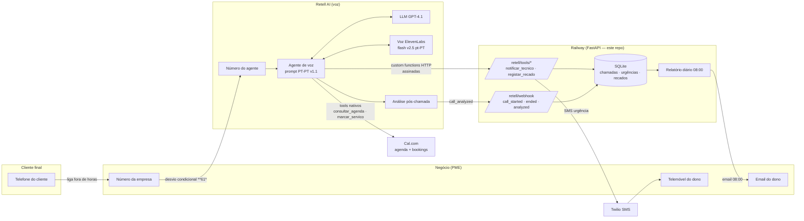
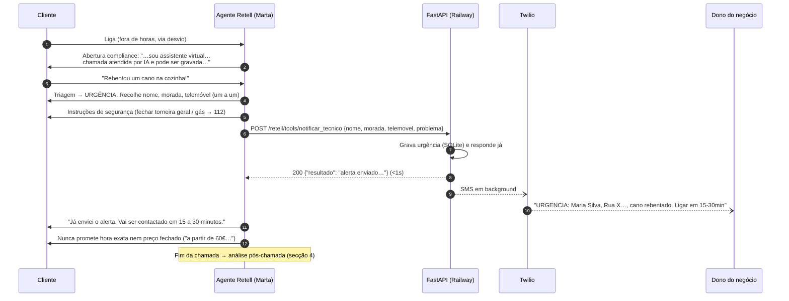
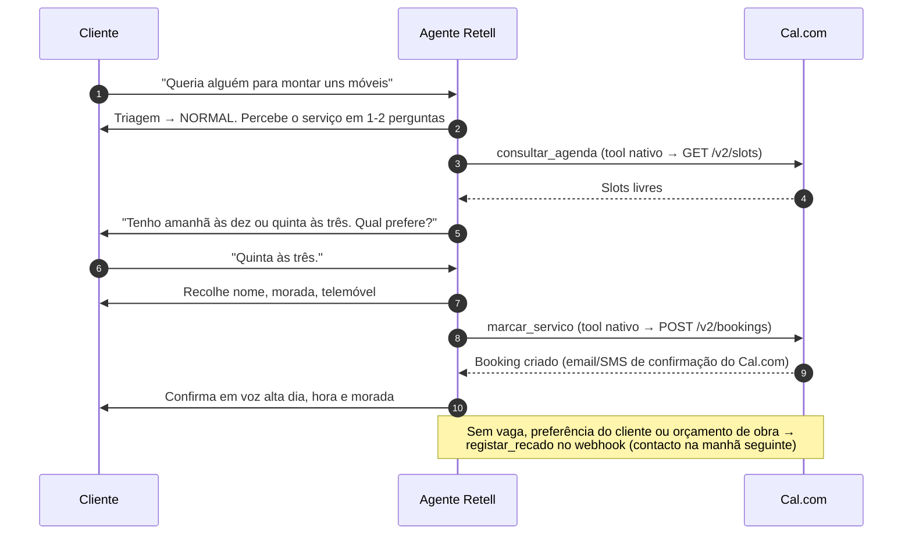
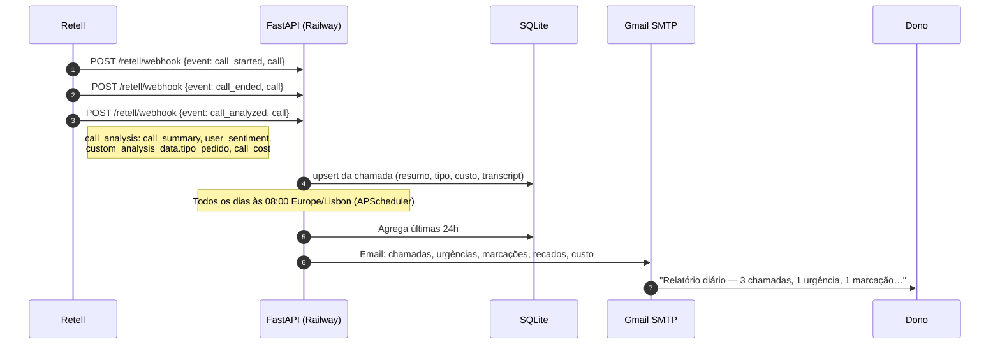
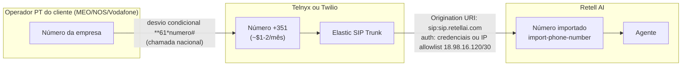
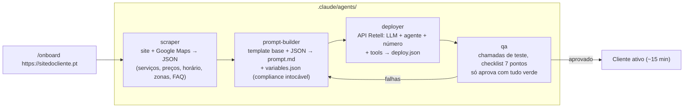

# Arquitetura Técnica — Recepcionista IA Fora de Horas

Versão: POC (jul/2026). Fontes técnicas verificadas: docs.retellai.com (custom functions, webhooks, custom telephony), SDKs oficiais Retell (Python/TypeScript), cal.com/docs (API v2), Twilio/Telnyx (números PT).

## 1. Componentes do sistema



**Decisões-chave**
- **Agenda pelos tools nativos Cal.com da Retell** (`check_availability_cal`/`book_appointment_cal`, com os nomes `consultar_agenda`/`marcar_servico`): zero código nosso no caminho da marcação.
- **Resumo de chamada pelo evento `call_analyzed`** (a plataforma produz `call_summary`, sentimento e `custom_analysis_data.tipo_pedido`): não existe tool in-call de resumo.
- **Webhook responde <1s** — a Retell corta custom functions lentas e o cliente fica em silêncio; SMS e escritas seguem em background.
- **Segurança**: todos os endpoints verificam `X-Retell-Signature` (HMAC-SHA256 da API key sobre corpo+timestamp, janela de 5 min — mesmo esquema do SDK oficial).

## 2. Fluxo de chamada — URGÊNCIA



## 3. Fluxo de chamada — PEDIDO NORMAL (marcação)



## 4. Pós-chamada e relatório diário



## 5. Telefonia em produção (+351)

A Retell só vende números US/CA. Em produção o agente precisa de um **número português importado**, porque o desvio do número da empresa para um número US seria cobrado ao dono como chamada internacional; para um +351 conta como chamada nacional (normalmente incluída no tarifário).



**Passos (Twilio como exemplo):** comprar número PT (regulatory bundle: identidade + comprovativo de morada <3 meses, sem apartado; aprovação típica ≤3 dias úteis, pode demorar mais) → criar Elastic SIP Trunk → Origination URI `sip:sip.retellai.com` → importar na Retell em E.164 com o termination URI + credenciais → associar o agente. Na Telnyx o processo é análogo (requisitos PT: NIF, certidão de registo comercial, morada compatível com o indicativo).

**Desvio no telemóvel/fixo do cliente (qualquer operador PT):**
- Ativar (se não atender): `**61*<número do agente>#`
- Desativar: `##61#` · Verificar: `*#61#`

## 6. Pipeline de onboarding de novos clientes (`/onboard <url>`)



O contrato entre subagentes está descrito em cada ficheiro de `.claude/agents/`. O `scripts/setup_retell.py` é a materialização do deployer para o cliente demo — o deployer generaliza-o por cliente (`clients/<nome>/`).

## 7. Estrutura do repositório

```
prompts/                     templates de system prompt
  prompt-agente-demo-arranjos-casa.md   ← template base v1.1 (nicho alargado)
  prompt-agente-demo-canalizadores.md   ← variante setorial v1.0
clients/demo/                variables.json + deploy.json do agente demo
webhooks/                    FastAPI (tools, eventos, relatório, SQLite)
scripts/setup_retell.py      cria/atualiza o agente na Retell (idempotente)
tests/                       pytest (15 testes)
docs/                        este ficheiro, PLANO-POC, SETUP, pitch/
.claude/agents/              subagentes do onboarding
Dockerfile + railway.json    deploy no Railway
```
